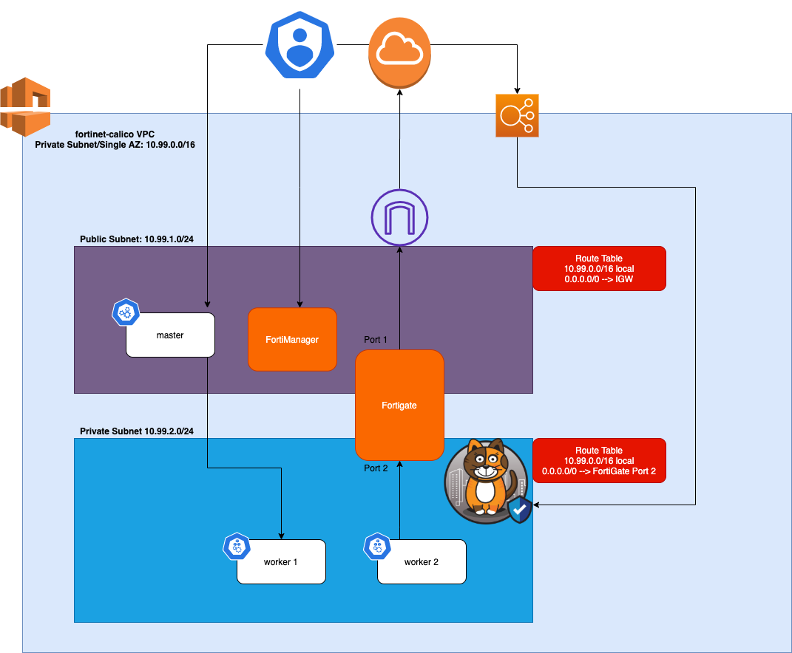

# Fortinet and Calico Solution Integration Enablement Workshop


## Summary and Goals

As a platform and security engineers, you want your apps to securely communicate with the external world. But you also want to secure the network traffic from the Kubernetes clusters using your Fortinet security fabricc. Using the Fortinet/Calico Enterprise integration, security teams can retain firewall responsibility, secure traffic using Calico Enterprise network policy, which frees up time for ITOps.

The goal of this enabelemnt tutorial is to demonstrate the value of the Fortinet + Calico Enterprise integration by going through a series of learning modules focused on Calico's Integration with Fortigate and FortiManager.

For reference, you can find the product documentation around this integration [here](https://docs.tigera.io/security/firewall-integration).

## Join the Slack Channel!

We have created a slack channel on the Calico User Group to discuss all things related to Calico + Fortinet. If you are not already a member of the Calico User Group Slack group you can sign up [here](https://slack.projectcalico.org/) and join the #fortinet-integration channel.

## Pre-Requisites/Requirements

- Calico Enterprise Trial or Production License along with a pull secret. If you do not have a license you can request one [here](https://www.tigera.io/tigera-products/calico-enterprise-trial#installation-trial)
- AWS credentials with the IAM role to create
  * VPC
  * Subnets
  * EC2 Instances
  * Secuirty Groups
  * ELB
- SSH client to connect to AWS resources
- A public/private SSH key pair created and added in your AWS account and for the specifc region you wish to run this in.
- Git 
- [Terraform](https://learn.hashicorp.com/tutorials/terraform/install-cli) v0.13+ installed locally.

## Architecture

Below is an architecture diagram of the various components that will be deployed. They are:
- A VPC with two subnets: one private and one public.
- An Internet Gateway attached to the Public Subnet
- A default security group to allow SSH acces, HTTP/HTTPs traffic, and specific TCP ports for Fortigate and FortiManager.
- Three EC2 instances for k8s: `master`, `worker-1`, and  `worker-2` launched in the private subnet. 
- A jumphost that will be deployed in the public subnet. This will be used to access the k8s VMs via SSH.
- A Fortigate and FortiManager VMs (PAYG).




## Workshop Modules

- [Module 1: Setting up your Local Environment](./modules/setting-up-local-env.md)
- [Module 2: Creating Your AWS Environment with Terraform](./modules/setting-up-aws.md)
- [Module 3: Configuring Fortigate to allow Internet Traffic](./modules/configuring-fortigate-to-allow-internet.md)
- [Module 4: Accessing the K8s Nodes](./modules/accessing-your-k8s-nodes.md)
- [Module 5: Creating Your Kubernetes Cluster](./modules/creating-your-k8s-cluster.md)
- [Module 6: Installing and Configuring Calico Enterprise](./modules/installing-calico.md)
- [Module X: Joining Worker Nodes](./modules/join-nodes.md)
- [Module 7: Integrating FortiManager with FortiGate](./modules/integrate-fortigate-fortimanager.md)
- [Module 8: Integrating Calico Enterprise with FortiManager and FortiGate](./modules/integrate-calico-fortigate.md)
- [Module 9: Running a Sample Application](./modules/deploy-app.md)


### Cleanup

You can issue a `terraform destroy` to fully remove all the environment resources.

```
🐯 → terraform destroy 
...
Do you really want to destroy all resources?
  Terraform will destroy all your managed infrastructure, as shown above.
  There is no undo. Only 'yes' will be accepted to confirm.

  Enter a value: yes
```

