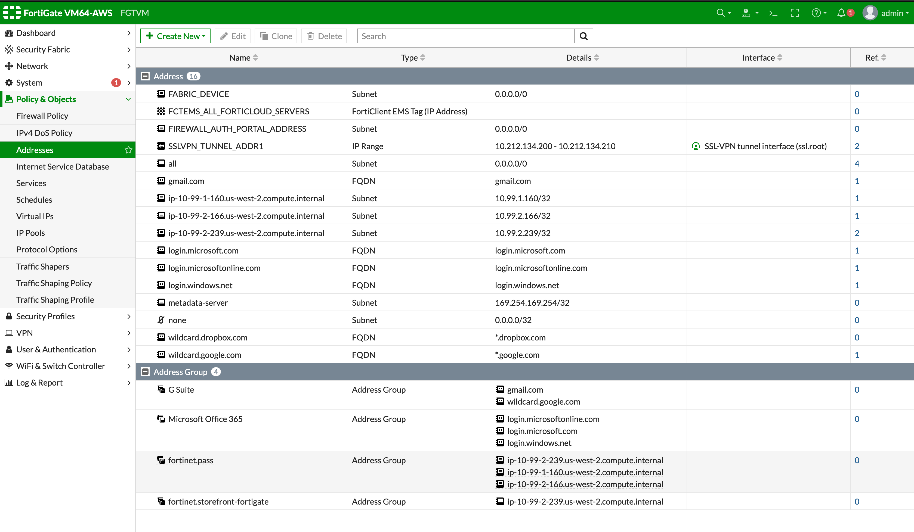
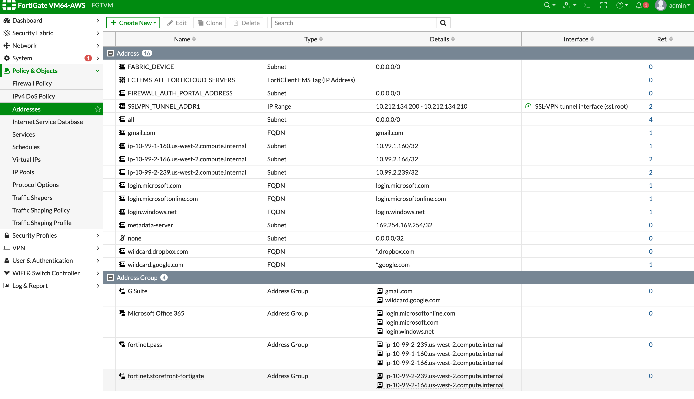

# Module 10: Running a Sample Application 

**Goal:** We are now ready to verify the integration by launching an application and scaling its pods to ensure that the pods' IPs are automatically populated in FortiGate.


## Steps

1. Under the `demo` subdirectory, there is a `tiers-demo.yaml` and `storefront-demo.yaml` deployment files. Let's take a look at the `tiers-demo.yaml`:


```
apiVersion: projectcalico.org/v3
kind: Tier
metadata:
  name: fortinet
spec:
  order: 800
---
apiVersion: projectcalico.org/v3
kind: Tier
metadata:
  name: platform
spec:
  order: 700
---
apiVersion: projectcalico.org/v3
kind: Tier
metadata:
  name: security
spec:
  order: 500
---
apiVersion: projectcalico.org/v3
kind: GlobalNetworkPolicy
metadata:
  name: fortinet.pass
spec:
  tier: fortinet
  order: 300
  selector: ''
  namespaceSelector: ''
  serviceAccountSelector: ''
  ingress:
    - action: Pass
      source: {}
      destination: {}
  egress:
    - action: Pass
      source: {}
      destination: {}
  doNotTrack: false
  applyOnForward: false
  preDNAT: false
  types:
    - Ingress
    - Egress
---
apiVersion: projectcalico.org/v3
kind: GlobalNetworkPolicy
metadata:
  name: platform.pass
spec:
  tier: platform
  order: 300
  selector: ''
  namespaceSelector: ''
  serviceAccountSelector: ''
  ingress:
    - action: Pass
      source: {}
      destination: {}
  egress:
    - action: Pass
      source: {}
      destination: {}
  doNotTrack: false
  applyOnForward: false
  preDNAT: false
  types:
    - Ingress
    - Egress
---
apiVersion: projectcalico.org/v3
kind: GlobalNetworkPolicy
metadata:
  name: security.pass
spec:
  tier: security
  order: 300
  selector: ''
  namespaceSelector: ''
  serviceAccountSelector: ''
  ingress:
    - action: Pass
      source: {}
      destination: {}
  egress:
    - action: Pass
      source: {}
      destination: {}
  doNotTrack: false
  applyOnForward: false
  preDNAT: false
  types:
    - Ingress
    - Egress
---
apiVersion: projectcalico.org/v3
kind: GlobalNetworkPolicy
metadata:
  name: fortinet.storefront-fortigate
spec:
  tier: fortinet
  selector: app == "microservice2"
  namespaceSelector: ''
  serviceAccountSelector: ''
  egress:
    - action: Allow
      source: {}
      destination: {}
  doNotTrack: false
  applyOnForward: false
  preDNAT: false
  types:
    - Egress
```

This deployment creates the necessary Calico Enterprise Tiers , one of which is the `fortinet` Tier. This tier is the one that we have configured in the previous module to associate all policies under it with a FortiGate Address group. There are also other tiers like `security` and `platform` that are used for demonstrative purposes. Finally, the last part of it is the `GlobalNetworkPolicy` that maps out the application labels to Fortigate address group. In our example, this configuration will create a Fortigate Address group named `storefront-fortigate` that automatically detects and populate the node IPs of any pod with label `app == 'microservice2'`

2. You can copy these two YAML files into your master nodes and deploy them:

```
$ kubectl apply -f tiers-demo.yaml 
$ kubectl apply -f storefront-demo.yaml
```

Verify that the storefront application is deployed:

```
$ kubectl get pod -n storefront
NAME                             READY   STATUS    RESTARTS   AGE
backend-745777bb7b-j645w         2/2     Running   0          169m
frontend-75875cb97c-8k2pw        4/4     Running   0          169m
logging-5fb76b5d89-kqg2r         1/1     Running   0          169m
microservice1-7cbddc58bf-w25wc   4/4     Running   0          169m
microservice2-9f7f68f9d-jps29    5/5     Running   0          169m
```

3. In the FortiGate portal, navigate to **Policy & Objects > Addresses**. Once the application is deployed, you should see that an **storefront-fortigate** address group is created and the respective Node IPs are associated with it.




4. It's time to showcase what would happen as we scale the `mircroservice2` service. As we increase the number of pods, we should see the Address Group in FortiGate reflect the nodes that the pods are deployed in.

```
$ kubectl scale deployment/microservice2 -n storefront --replicas=2
```




5. You can now explore creating policies within FortiGate that use this address group!


