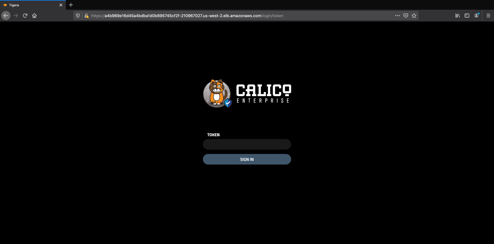

# Module 7: Joining Worker Nodes to the Cluster

**Goal:** Joining the other two worker nodes to the cluster. 


1. Now that we installed Calico, we need to join the other nodes. For every worker node, ssh into the node and update the `1-kubeadm-join-config.yaml` file with the node details. You need to update the following for every worker node.
    a. `apiServerEndpoint`  to reflect MASTER PRIVATE IP
    b. `caCertHashes` to reflect the SHA hash of the CA. This was provided in the output of the `kubeadm init` step that you've done previously.
    c. `name` to reflect the full hostname of the node (e.g `ip-10-99-2-177.us-west-2.compute.internal `)
     
  ```
    ---
    apiVersion: kubeadm.k8s.io/v1beta2
    kind: JoinConfiguration
    discovery:
    bootstrapToken:
        token: abcdef.0123456789abcdef                   
        apiServerEndpoint: "MASTER_PRIVATE_IP:6443"      # UPDATE to reflect MASTER PRIVATE IP
        caCertHashes: ["sha256:2a78c74c95db246c9d711276d1d0c9956cd36e765a1181519ab0f03a037488b6"]  # UPDATE based on kubeadm init output
    nodeRegistration:
    name: ip-10-99-2-177.us-west-2.compute.internal    # UPDATE with Full Hostname 
    kubeletExtraArgs:
        cloud-provider: aws
```

2. Using the update join configuration file, you can now join each of the nodes as follows:


```
$ sudo kubeadm join --config=5-join-config.yaml
[preflight] Running pre-flight checks
        [WARNING IsDockerSystemdCheck]: detected "cgroupfs" as the Docker cgroup driver. The recommended driver is "systemd". Please follow the guide at https://kubernetes.io/docs/setup/cri/
[preflight] Reading configuration from the cluster...
[preflight] FYI: You can look at this config file with 'kubectl -n kube-system get cm kubeadm-config -oyaml'
[kubelet-start] Writing kubelet configuration to file "/var/lib/kubelet/config.yaml"
[kubelet-start] Writing kubelet environment file with flags to file "/var/lib/kubelet/kubeadm-flags.env"
[kubelet-start] Starting the kubelet
[kubelet-start] Waiting for the kubelet to perform the TLS Bootstrap...

This node has joined the cluster:
* Certificate signing request was sent to apiserver and a response was received.
* The Kubelet was informed of the new secure connection details.

Run 'kubectl get nodes' on the control-plane to see this node join the cluster.
  ```


3. Verify that you have successfully joined the nodes to the cluster. On your `master` node:

  ```
  $ kubectl get nodes
  NAME           STATUS     ROLES    AGE     VERSION
  ip-10-99-2-11.us-west-2.compute.internal   Ready   <none>   2m13s   v1.19.2
  ip-10-99-2-22.us-west-2.compute.internal  Ready   <none>   2m12s   v1.19.2
  ip-10-99-2-54.us-west-2.compute.internal        Ready   master   16m     v1.19.2
  ```

4. If you give it a couple of minutes, you should be able to see all the Calico Enterprise components in the ready state:

```
$ kubectl get tigerastatus
NAME                  AVAILABLE   PROGRESSING   DEGRADED   SINCE
apiserver             True        False         False      136m
calico                True        False         False      25m
compliance            True        False         False      19m
intrusion-detection   True        False         False      20m
log-collector         True        False         False      20m
log-storage           True        False         False      136m
manager               True        False         False      19m
```

5. You should also be able to see the ELB loadbalancer that was created for Calico Enterprise's UI. You should be able to access the Calico Enterpruse UI using this ELB. Use your browser and go to `https://ELB_URL`. 

```
$ kubectl get svc -n tigera-manager
NAME                      TYPE           CLUSTER-IP       EXTERNAL-IP                                                              PORT(S)         AGE
tigera-manager            ClusterIP      192.168.230.13   <none>                                                                   9443/TCP        33m
tigera-manager-external   LoadBalancer   192.168.37.170   XXXXXXX.us-west-2.elb.amazonaws.com   443:31559/TCP   5m8s
```

